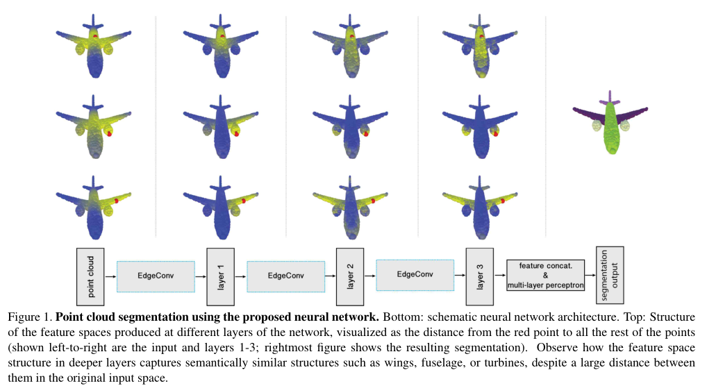
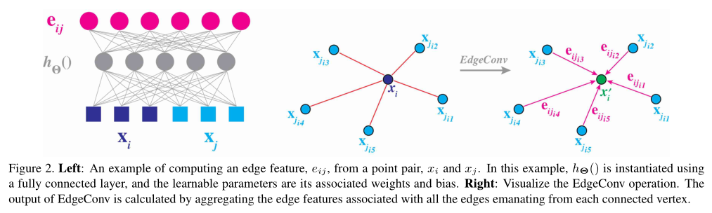

# DGCNN

a pytorch implimentation of Dynamic Graph CNN(EdgeConv)

## Training

I impliment the classfication network in the [paper](https://arxiv.org/abs/1801.07829v1), and only the vanilla version. DGCNN(Dynamic Graph CNN) is based on the architecture of PointNet to do a point cloud classification task or a segmentation task. 

To train the model, just set the path of you ModelNet40 dataset(you can download it from [here](https://shapenet.cs.stanford.edu/media/modelnet40_ply_hdf5_2048.zip)) in dataset.py.

Run: `python dataset.py`, without any error printed. If does, please check the path of your dataset.

If you want to change the hyper-parameters of the model, you can modify `params.py` yourserf.

Then, just simply runing: `python train.py`, and it will start training. The training procedure would be saved in a directory called `summary` , and the model weights would be saved in a directory called `weights`.

## Results

The classification accuracy on test set is 91.2% on ModelNet40 dataset. And my training result is here:

| hyper-parameters              | accuracy |
| ----------------------------- | -------- |
| Dynamic Graph CNN(base, K=10) | 89.47%   |
| Dynamic Graph CNN(base, K=20) | 89.55%   |
| Dynamic Graph CNN(base, K=30) | 91.00%   |
| Dynamic Graph CNN(base, K=40) | 91.13%   |
| Dynamic Graph CNN(base, K=50) | 89.99%   |

## Links

- [Dynamic Graph CNN for Learning on Point Clouds](https://arxiv.org/abs/1801.07829v1)

- [ModelNet40](https://shapenet.cs.stanford.edu/media/modelnet40_ply_hdf5_2048.zip)

